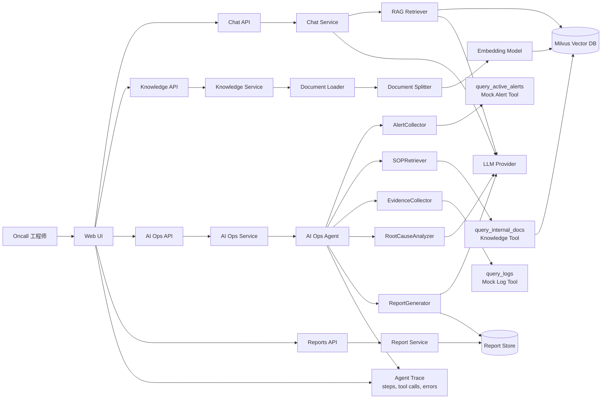

# OnCall Agent

基于 RAG 和多步 Agent 工具调用的智能 Oncall 故障分析助手。

OnCall Agent 面向后端研发、SRE、平台工程师和一线 Oncall 值班人员，定位为“故障排查辅助系统”，不是自动处置系统。它通过内部 SOP 知识库、Mock 告警、Mock 日志和大模型 Agent 编排能力，帮助工程师完成告警理解、SOP 匹配、证据查询、根因分析和结构化报告生成。

## 当前阶段目标

本阶段聚焦把原型收敛为一条可演示、可测试、可解释的 MVP 链路：

1. 明确项目名称及定位：`OnCall Agent`，智能 Oncall/AIOps 故障分析助手。
2. 明确项目核心用户场景：知识库构建、RAG 问答、AI Ops 一键告警分析。
3. 暂时砍掉非核心功能：不做自动修复、不做复杂权限、不接真实生产平台、不支持全格式文档解析。

## 核心用户场景

### 1. 知识库构建

Oncall 工程师上传 Markdown 或 TXT 格式的告警处理手册、运维 SOP、故障复盘文档。系统完成文件校验、内容解析、文档切片、向量化，并将 chunk 与元数据写入 Milvus，形成可检索的内部知识库。

### 2. RAG 智能问答

用户用自然语言询问告警含义、错误码、处理步骤或系统背景。系统从知识库召回相关 SOP 片段，将检索结果与用户问题组合为 prompt，调用大模型生成带引用来源的回答。

### 3. AI Ops 一键分析

用户点击 AI Ops 分析入口后，系统查询 Mock 活跃告警，根据告警名称检索 SOP，再按 SOP 要求调用日志工具收集证据，最终生成结构化告警分析报告，并展示 Agent 执行步骤。

## MVP 功能范围

必须保留：

- 普通聊天问答
- SSE 流式聊天
- Markdown/TXT 文档上传
- 文档切片与向量索引
- 基于 Milvus 的知识库检索
- RAG 增强问答
- Mock 告警数据源
- Mock 日志数据源
- AI Ops 一键分析
- Agent 执行步骤记录
- 结构化告警分析报告
- 基础配置管理
- Docker Compose 本地启动

暂不实现：

- 多租户
- 复杂 RBAC 权限系统
- 任意 SQL 执行
- 自动执行修复动作
- 自动重启服务或修改线上配置
- 自动关闭告警
- 生产级告警降噪
- 多模型动态路由
- PDF/DOCX 全格式解析
- Kubernetes 生产部署
- 真实 Prometheus 或日志平台接入

## 系统架构图



## AI Ops Agent 工作流

```text
AlertCollector -> SOPRetriever -> EvidenceCollector -> RootCauseAnalyzer -> ReportGenerator
```

节点职责：

- `AlertCollector`：查询当前活跃告警。
- `SOPRetriever`：根据告警名称检索内部 SOP。
- `EvidenceCollector`：按 SOP 要求查询日志或指标证据。
- `RootCauseAnalyzer`：结合告警、SOP 和证据分析可能根因。
- `ReportGenerator`：生成固定结构的告警分析报告。

## 完整 Demo 链路

### 前置数据

准备一份 Markdown SOP，例如 `告警处理手册.md`：

```markdown
# 服务下线告警处理手册

## 告警名称
服务下线

## 排查步骤
1. 确认告警服务名、实例和地域。
2. 查询最近 30 分钟服务启动、停止和健康检查日志。
3. 检查是否存在部署、重启、依赖连接失败或健康检查超时。
4. 如果发现实例主动退出，优先查看退出前错误日志。

## 处理建议
- 如果是发布导致，联系发布负责人确认变更。
- 如果是依赖连接失败，检查依赖服务状态。
- 如果是健康检查超时，观察 CPU、内存和接口耗时。
```

### 演示步骤

1. 启动项目。
2. 进入 Knowledge 页面，上传 `告警处理手册.md`。
3. 系统解析文档，按标题和长度切片，生成 embedding，并写入 Milvus。
4. 进入 Chat 页面，提问：`服务下线告警应该怎么处理？`
5. 系统检索知识库，召回“服务下线告警处理手册”，返回基于 SOP 的处理步骤。
6. 进入 AI Ops 页面，点击“一键分析”。
7. 系统调用 `query_active_alerts`，读取 Mock 活跃告警，例如：

```json
{
  "alert_name": "服务下线",
  "service": "payment-api",
  "severity": "critical",
  "region": "ap-shanghai",
  "instance": "payment-api-03",
  "triggered_at": "2026-06-08T10:15:00+08:00",
  "description": "payment-api-03 健康检查连续失败，实例从服务发现中摘除"
}
```

8. AI Ops Agent 根据告警名称调用 `query_internal_docs`，匹配“服务下线” SOP。
9. Agent 根据 SOP 调用 `query_logs`，查询 `payment-api` 在告警前后 30 分钟内的日志。
10. Mock 日志工具返回关键证据，例如健康检查失败、依赖连接超时、实例退出前错误摘要。
11. Agent 汇总告警、SOP 和日志证据，生成结构化报告。
12. 页面展示 Agent 执行步骤、工具调用摘要、证据链和最终结论。

### 预期报告结构

```text
告警分析报告

一、活跃告警
- 告警名称：服务下线
- 服务：payment-api
- 级别：critical
- 触发时间：2026-06-08T10:15:00+08:00
- 当前状态：活跃

二、SOP 匹配结果
- 匹配文档：服务下线告警处理手册
- 推荐排查步骤：确认实例、查询健康检查日志、检查部署和依赖连接状态

三、证据收集
- 日志查询条件：payment-api，ap-shanghai，告警前后 30 分钟
- 日志摘要：实例 payment-api-03 多次健康检查失败，并出现依赖连接超时
- 指标查询条件：MVP 阶段暂不接真实指标平台
- 指标摘要：无

四、根因分析
- 可能根因：依赖服务连接超时导致健康检查失败，实例被服务发现摘除
- 判断依据：告警描述、SOP 匹配结果、健康检查失败日志和依赖超时日志一致
- 置信度：中

五、处理建议
- 建议动作：检查依赖服务状态，联系 payment-api 发布负责人确认近期变更
- 风险提示：不要由 Agent 自动重启服务或修改线上配置
- 后续观察项：观察实例恢复情况、健康检查通过率和依赖错误日志

六、结论
- 本次告警更可能由依赖连接异常触发，建议人工确认依赖状态后再执行处置。
```

## 安全边界

- 不提交真实 API Key，仅保留 `.env.example`。
- 所有敏感配置从环境变量读取。
- 禁止模型执行任意 SQL。
- 禁止模型直接执行系统命令。
- 工具必须有输入 schema、超时控制和 trace 记录。
- 工具失败只返回错误，不终止服务进程。
- 文件上传需要限制类型、大小，并防止路径穿越。

## 验收标准

- 可以通过 Docker Compose 启动后端、前端和 Milvus。
- 可以上传 Markdown/TXT 文档并完成索引。
- 可以基于上传文档完成 RAG 问答。
- 可以点击 AI Ops 触发 Mock 告警分析。
- 可以生成结构化告警分析报告。
- 可以看到 Agent 执行步骤和工具调用摘要。
- 项目中没有真实 API Key。
- 工具错误不会导致服务进程退出。
