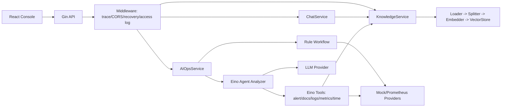

# 智能 Oncall 助手

智能 Oncall 助手是一个面向后端研发、SRE 和平台工程师的故障排查辅助系统。项目采用 **Gin 搭建 API 服务，Eino 编排 Agent 工具调用** 的架构，支持 SOP 知识库 RAG 问答、告警分析、日志/指标证据收集、Agent 工具调用和结构化故障报告生成。默认环境使用 `mock + memory + rule`，不依赖真实 LLM、DashScope、Milvus、Prometheus 或外部网络。

## 核心功能

- SOP 文档上传、切片、向量索引和知识库检索。
- Chat RAG 问答，返回 answer、sources、citations、trace_id。
- AI Ops 告警分析，返回 alerts、steps、evidence、citations、report。
- `rule` / `agent` 双模式，agent 失败可 fallback 到 rule workflow。
- 前端控制台：Knowledge、Chat、AI Ops、Reports、Settings。
- 统一响应结构、trace_id 全链路、文件上传校验、工具边界和默认无外部依赖测试。

## 技术栈

- API 层：Go 1.23+、Gin、slog、YAML config。
- Agent 编排：Eino Agent、JSON Schema Tool、只读工具调用、fallback。
- RAG：Loader、Splitter、Mock/DashScope Embedder、Memory/Milvus VectorStore。
- AI Ops：RuleBasedAnalyzer、EinoAgentAnalyzer、Alert/Log/Metric Provider。
- 前端：React、Vite、TypeScript、lucide-react、marked、DOMPurify。
- 部署：Docker Compose、Nginx、可选 Milvus/etcd/MinIO/Attu。

## 系统架构



更完整说明见 [docs/architecture.md](docs/architecture.md)。

相关设计文档：

- [RAG 设计](docs/rag-design.md)
- [AI Ops 工作流](docs/aiops-workflow.md)
- [评测说明](docs/evaluation.md)

架构分工：

- Gin 负责 HTTP 入口、路由注册、参数绑定、统一响应、trace_id、中间件、panic recovery 和 CORS。
- Service 负责业务边界，连接 Chat、Knowledge、AI Ops 三类能力。
- Eino 负责 Agent 模式下的工具抽象、工具调用记录、LLM 报告生成和执行约束。
- Rule workflow 保留为确定性 fallback，保证 demo、测试和异常场景稳定。

## 快速开始

后端：

```bash
go mod download
go run ./cmd/server
```

默认监听 `http://localhost:8080`。

前端：

```bash
cd web/frontend
npm install
npm run dev
```

默认访问 `http://localhost:5173`，后端 API 默认为 `http://localhost:8080/api`。如需覆盖：

```bash
VITE_API_BASE_URL=http://localhost:8080/api npm run dev
```

Windows PowerShell：

```powershell
$env:VITE_API_BASE_URL="http://localhost:8080/api"
npm run dev
```

常用命令：

```bash
make dev
make test
make build
make docker-config
```

没有 Make 的 Windows 环境可直接执行：

```powershell
go test ./...
cd web/frontend
npm run build
```

## Demo 演示流程

默认 demo 使用内置 mock provider，场景稳定可复现：

- 告警：`服务下线`
- 服务：`billing-service`
- SOP：服务 panic 导致 pod 重启
- 日志：`panic: runtime error: invalid memory address or nil pointer dereference`
- 指标：`restart_count` 增加
- 结论：应用 panic 导致服务实例重启，引发服务下线

演示步骤：

1. 启动后端和前端。
2. 在 Knowledge 页面上传 [docs/demo/告警处理手册.md](docs/demo/告警处理手册.md)。
3. 搜索 `服务下线 panic restart_count`，确认能看到 citations。
4. 在 Chat 页面输入 `服务下线告警应该怎么处理？`。
5. 在 AI Ops 页面使用 `alert_name=服务下线`、`service=billing-service` 触发分析。
6. 查看 alerts、steps、evidence、citations、report、trace_id。
7. 在 Reports 页面查看历史报告，验证复制和下载。

curl 演示：

```bash
curl -X POST http://localhost:8080/api/knowledge/upload \
  -H "X-Trace-ID: trace-demo-upload" \
  -F "file=@docs/demo/告警处理手册.md"

curl -X POST http://localhost:8080/api/chat \
  -H "Content-Type: application/json" \
  -H "X-Trace-ID: trace-demo-chat" \
  -d '{"message":"服务下线告警应该怎么处理？"}'

curl -X POST http://localhost:8080/api/aiops/analyze \
  -H "Content-Type: application/json" \
  -H "X-Trace-ID: trace-demo-aiops" \
  -d '{"alert_name":"服务下线","service":"billing-service"}'
```

完整说明见 [docs/demo-guide.md](docs/demo-guide.md)。

## 页面说明

- Knowledge：上传 SOP，查看文档列表，执行知识库搜索。
- Chat：RAG 问答，展示 citations 和 trace_id。
- AI Ops：触发告警分析，展示工作流步骤、证据链和结构化报告。
- Reports：浏览器 localStorage 中的历史报告。
- Settings：后端健康状态、API Base URL 和 provider 状态。

Markdown 渲染使用 `marked` 解析，并通过 `DOMPurify` 清理后再写入页面。

## API 示例

统一响应结构：

```json
{
  "code": 0,
  "message": "ok",
  "data": {},
  "trace_id": "trace-demo"
}
```

知识库检索：

```http
POST /api/knowledge/search
Content-Type: application/json

{
  "query": "服务下线怎么处理",
  "top_k": 3
}
```

Chat：

```http
POST /api/chat
Content-Type: application/json

{
  "message": "服务下线告警应该怎么处理？"
}
```

AI Ops：

```http
POST /api/aiops/analyze
Content-Type: application/json

{
  "alert_name": "服务下线",
  "service": "billing-service"
}
```

AI Ops 响应 `data` 包含：

```json
{
  "trace_id": "trace-demo-aiops",
  "mode": "rule",
  "fallback_used": false,
  "alerts": [],
  "steps": [],
  "evidence": [],
  "citations": [],
  "report": "告警分析报告\n..."
}
```

## 配置说明

默认配置位于 [configs/config.yaml](configs/config.yaml)，示例环境变量位于 [.env.example](.env.example)。仓库只提交 `.env.example`，不要提交 `.env`、真实 API Key、Token、个人路径或真实平台地址。

默认模式：

```yaml
rag:
  embedder_provider: mock
  vector_store_provider: memory
aiops:
  mode: rule
  fallback_to_rule: true
  alert_provider: mock
  log_provider: mock
  metric_provider: mock
llm:
  provider: mock
```

Milvus RAG 模式：

```bash
docker compose --profile milvus up -d etcd minio milvus

DASHSCOPE_API_KEY=your-local-key \
RAG_EMBEDDER_PROVIDER=dashscope \
RAG_VECTOR_STORE_PROVIDER=milvus \
MILVUS_ADDRESS=localhost:19530 \
go run ./cmd/server
```

Agent 模式：

```bash
AIOPS_MODE=agent \
AIOPS_FALLBACK_TO_RULE=true \
LLM_PROVIDER=mock \
go run ./cmd/server
```

真实 LLM Agent：

```bash
AIOPS_MODE=agent \
LLM_PROVIDER=openai-compatible \
LLM_API_KEY=your-local-key \
LLM_BASE_URL=https://api.openai.com/v1 \
LLM_MODEL=your-model \
go run ./cmd/server
```

## 测试说明

默认测试不依赖外部网络或外部服务：

```bash
go test ./...
cd web/frontend
npm run build
```

外部集成测试默认跳过，必须显式开启：

```bash
RUN_MILVUS_INTEGRATION_TEST=1 go test ./internal/rag/indexer -run TestMilvusVectorStoreIntegration

RUN_EMBEDDING_INTEGRATION_TEST=1 \
DASHSCOPE_API_KEY=your-local-key \
go test ./internal/rag/embedder -run TestDashScopeEmbedderIntegration

RUN_AGENT_INTEGRATION_TEST=1 \
LLM_PROVIDER=openai-compatible \
LLM_API_KEY=your-local-key \
LLM_BASE_URL=https://api.openai.com/v1 \
LLM_MODEL=your-model \
go test ./internal/service -run TestRealLLMAgentIntegration
```

CI 默认执行：

- `go test ./...`
- `npm ci`
- `npm run build`

## Docker 部署

最小 demo 模式：

```bash
docker compose up --build
```

访问：

- 前端：`http://localhost:5173`
- 后端：`http://localhost:8080`

Milvus RAG 模式：

```bash
docker compose --profile milvus up --build
```

如需让后端使用 Milvus 和 DashScope，在本地 `.env` 中设置：

```env
RAG_EMBEDDER_PROVIDER=dashscope
RAG_VECTOR_STORE_PROVIDER=milvus
DASHSCOPE_API_KEY=your-local-key
MILVUS_ADDRESS=milvus:19530
```

数据卷目录 `data/`、`deployments/.data/`、`volumes/` 已加入 `.gitignore`。

## 目录结构

```text
cmd/server                 # 服务入口
configs                    # 默认 YAML 配置
internal/api               # Gin HTTP 路由、中间件、统一响应
internal/service           # Chat、Knowledge、AI Ops 业务编排和 Eino Agent Analyzer
internal/rag               # Loader、Splitter、Embedder、VectorStore
internal/tools             # Provider 和 Agent 工具边界
internal/infra             # config、trace、logger、upload
web/frontend               # React + Vite 控制台
docs                       # 架构、RAG、AI Ops、安全、demo、简历文档
docs/demo                  # 稳定 demo 数据
deployments                # Dockerfile、Nginx、Milvus compose
```

## 安全设计

- 默认不访问真实外部服务。
- Agent 工具只读，不提供自动修复、SQL 执行、系统命令执行、关闭告警等危险能力。
- 文件上传限制扩展名、大小并防路径穿越。
- 所有 API 返回 trace_id，错误统一包装。
- 前端 Markdown 渲染经过 DOMPurify 清理。
- 日志不打印 API Key。

详见 [docs/security-design.md](docs/security-design.md)。

## 阶段性演进

- 阶段 1：基于 Gin 的后端 API 骨架、Service 分层、Mock AI Ops。
- 阶段 2：配置安全、统一错误、trace_id、上传校验、日志和测试。
- 阶段 3A：本地 RAG 闭环。
- 阶段 3B：DashScope Embedder 和 Milvus VectorStore 可配置切换。
- 阶段 4：规则版 AI Ops 工作流。
- 阶段 5：基于 Eino 的 Agent 工具编排和 fallback。
- 阶段 6：React 前端控制台。
- 阶段 7：测试、部署、demo 数据、文档和简历包装。

## 简历亮点

短版：

```text
基于 Go + Gin + Eino + Milvus + React 构建智能 Oncall 助手，使用 Gin 搭建 API 服务、Eino 编排 Agent 工具调用，支持 SOP 知识库 RAG 问答、告警自动分析、日志/指标证据收集和结构化故障报告生成。
```

详见 [docs/resume-description.md](docs/resume-description.md)。

## 常见问题

- `dashscope api key is required`：启用了 `RAG_EMBEDDER_PROVIDER=dashscope`，但没有设置 `DASHSCOPE_API_KEY`。
- `llm api_key is required`：启用了 `LLM_PROVIDER=openai-compatible`，但没有设置 `LLM_API_KEY`。
- `milvus ... failed`：Milvus 未启动、地址错误或 collection 配置不一致。
- Chat 没有 citations：先在 Knowledge 上传 SOP，再提问与 SOP 相关的问题。
- AI Ops 没有 SOP citations：先上传 `docs/demo/告警处理手册.md`，再触发分析。
- 前端无法连后端：确认后端 `:8080` 已启动，或设置 `VITE_API_BASE_URL`。

## 后续规划

- 接入真实 Prometheus metrics、日志平台和告警平台。
- 报告从 localStorage 升级为后端持久化。
- 增加 OpenTelemetry tracing。
- 补充前端组件测试和 E2E smoke test。
