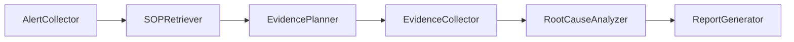
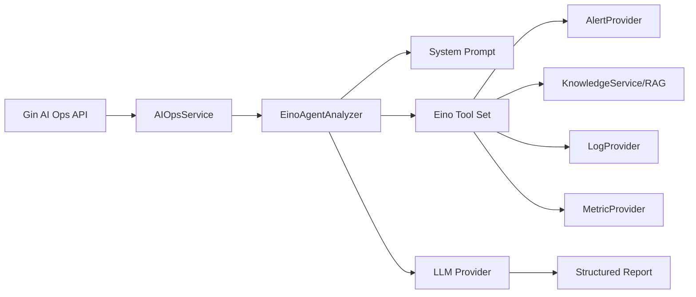

# AI Ops 工作流

AI Ops 支持 `rule` 和 `agent` 两种模式。默认使用 `rule`，保证测试和 demo 稳定；`agent` 需要显式开启，并支持失败 fallback 到 rule workflow。

整体架构中，Gin 只负责接收 `/api/aiops/analyze` 请求并返回统一响应；AI Ops 的任务编排在 Service 层完成。Agent 模式由 Eino 承接工具定义、工具调用记录和 LLM 报告生成。

## Rule Workflow



步骤说明：

- AlertCollector：查询活跃告警，无告警时生成明确报告并跳过后续分析。
- SOPRetriever：调用 KnowledgeService 检索 SOP，生成 citations 和 SOP evidence。
- EvidencePlanner：按告警生成日志和指标查询计划。
- EvidenceCollector：调用 LogProvider、MetricProvider，保留 evidence。
- RootCauseAnalyzer：规则判断 panic、restart_count 等证据。
- ReportGenerator：输出结构化报告。

## Eino Agent Workflow

Agent 模式通过 Eino `InvokableTool` 封装复用已有边界：

- `query_active_alerts`
- `query_internal_docs`
- `query_logs`
- `query_metrics`
- `get_current_time`

工具只读，不包含自动修复、SQL 执行、系统命令执行或关闭告警能力。



当前实现保留确定性 `AgentRunner`：它按 OnCall 排障的必要顺序调用 Eino 工具，再交给 LLM 生成报告。这样做的目标是让 demo、测试和 fallback 路径稳定，同时保留 Eino 工具抽象和真实 LLM 接入能力。

## Fallback

```text
mode=agent
  -> agent 成功：返回 agent 结果
  -> agent 失败且 fallback_to_rule=true：插入 AgentAnalyzer failed step，返回 rule 结果
  -> agent 失败且 fallback_to_rule=false：返回标准错误响应
```

## 数据流

AI Ops 响应统一返回：

- `alerts`
- `steps`
- `evidence`
- `citations`
- `report`
- `trace_id`
- `mode`
- `fallback_used`
