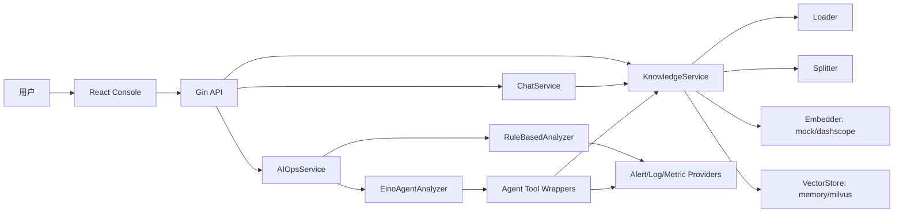

# 系统架构

智能 Oncall 助手由 Go 后端、React 前端、本地 RAG 模块和 AI Ops 工作流组成。默认模式为 `mock + memory + rule`，不依赖外部服务；DashScope、Milvus、Prometheus、真实 LLM 都需要显式配置。

## 模块图



## 前后端交互

- 前端通过 `/api` 调用后端，所有请求带 `X-Trace-ID`。
- 后端中间件生成或透传 trace_id，并写入响应 header 和统一响应体。
- 前端页面包括 Knowledge、Chat、AI Ops、Reports、Settings。

## 后端分层

- `internal/api`：HTTP 路由、参数绑定、统一响应和错误处理。
- `internal/service`：Chat、Knowledge、AI Ops 业务编排。
- `internal/rag`：Loader、Splitter、Embedder、VectorStore 抽象和实现。
- `internal/tools/aiops`：Alert、Log、Metric provider 边界。
- `internal/agent` 与 `internal/service/*agent*`：Agent 编排、工具封装和 fallback。
- `internal/infra`：配置、日志、trace、上传安全校验。

## 默认运行链路

```text
上传 SOP -> Loader -> Splitter -> Mock Embedder -> Memory VectorStore
Chat 问答 -> Knowledge Search -> citations -> mock RAG answer
AI Ops -> mock alerts/logs/metrics -> SOP 检索 -> root cause -> report
```
