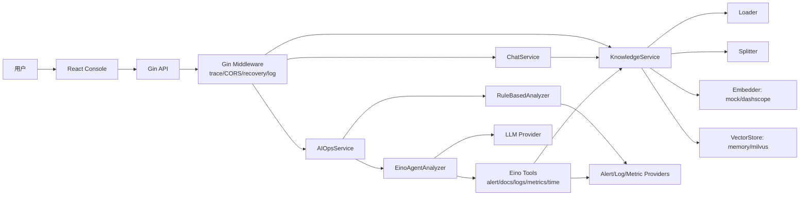

# 系统架构

智能 Oncall 助手由 React 前端、Gin API 服务、RAG 知识库和 Eino Agent 编排模块组成。默认模式为 `mock + memory + rule`，不依赖外部服务；DashScope、Milvus、Prometheus、真实 LLM 都需要显式配置。

相关细节见 [RAG 设计](rag-design.md)、[AI Ops 工作流](aiops-workflow.md) 和 [评测说明](evaluation.md)。

架构主线是 **Gin 搭建 API，Eino 编排 Agent**：

- Gin 负责 HTTP 层能力，包括路由、中间件、trace_id、CORS、panic recovery、请求日志和统一响应。
- Service 层承接业务编排，隔离 API、RAG、Provider 和 Agent 的边界。
- Eino Agent 负责 Agent 模式下的工具定义、JSON Schema 参数、工具调用记录、LLM 报告生成和执行约束。
- Rule workflow 是稳定 fallback，避免真实 LLM 或 Agent 工具异常影响 demo 和测试。

## 模块图



## 前后端交互

- 前端通过 `/api` 调用后端，所有请求带 `X-Trace-ID`。
- 后端中间件生成或透传 trace_id，并写入响应 header 和统一响应体。
- 前端页面包括 Knowledge、Chat、AI Ops、Reports、Settings。

## Gin API 层

- `cmd/server/main.go`：加载配置，初始化 KnowledgeService、AIOpsService、ChatService，并启动 Gin。
- `internal/api/router.go`：创建 `gin.Engine`，注册 `/api` 路由组和各业务 handler。
- `internal/api/middleware.go`：实现 trace_id、CORS、access log 和 panic recovery。
- `internal/api/*/handler.go`：只负责参数绑定、调用 service、返回统一响应，不承载 Agent 逻辑。

Gin 层保持薄 API 入口，避免把 RAG、Provider、Agent 编排直接写进 handler。

## Eino Agent 编排层

- `internal/service/aiops_agent_analyzer.go`：EinoAgentAnalyzer 入口，加载 LLM、工具集合、超时和 max_steps 配置。
- `internal/service/aiops_agent_tools.go`：封装 5 个 Eino `InvokableTool`，包括 `query_active_alerts`、`query_internal_docs`、`query_logs`、`query_metrics`、`get_current_time`。
- `internal/service/aiops_agent_prompt.go`：定义 Agent 系统 Prompt，约束证据来源、工具调用顺序和安全边界。
- `internal/service/aiops_service.go`：根据配置选择 `rule` 或 `agent`，并在 Agent 失败时 fallback 到 rule workflow。

Eino 层只通过 Provider、KnowledgeService 和 LLM Provider 访问外部能力，工具默认只读，不执行修复、SQL、系统命令或关闭告警。

## 后端分层

- `internal/api`：Gin 路由、参数绑定、统一响应和错误处理。
- `internal/service`：Chat、Knowledge、AI Ops 业务编排，包含 Eino Agent Analyzer 和 Agent Tools。
- `internal/rag`：Loader、Splitter、Embedder、VectorStore 抽象和实现。
- `internal/tools/aiops`：Alert、Log、Metric provider 边界。
- `internal/service/*agent*`：Eino Agent 编排、工具封装和 fallback。
- `internal/infra`：配置、日志、trace、上传安全校验。

## 默认运行链路

```text
上传 SOP -> Loader -> Splitter -> Mock Embedder -> Memory VectorStore
Chat 问答 -> Knowledge Search -> citations -> mock RAG answer
AI Ops -> mock alerts/logs/metrics -> SOP 检索 -> root cause -> report
```
