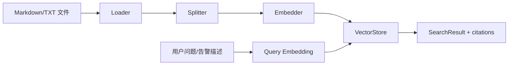

# RAG 设计

RAG 模块目标是支持 SOP 文档上传、检索和引用来源返回，同时保持默认环境开箱可运行。

## 数据流



## 组件

- Loader：读取 `.md`、`.markdown`、`.txt` 文件，生成 Document。
- Splitter：按标题和 chunk size 切片，保留 `source_file`、`title_path`。
- Embedder：默认 `mock`，可显式切换 `dashscope`。
- VectorStore：默认 `memory`，可显式切换 `milvus`。
- Retriever：由 `KnowledgeService.Search` 串联 query embedding 和 vector search。

## 双模式

默认模式：

```yaml
rag:
  embedder_provider: mock
  vector_store_provider: memory
```

真实 RAG 模式：

```bash
RUN_EMBEDDING_INTEGRATION_TEST=1
RAG_EMBEDDER_PROVIDER=dashscope
RAG_VECTOR_STORE_PROVIDER=milvus
DASHSCOPE_API_KEY=...
MILVUS_ADDRESS=localhost:19530
```

## citations

Chat 和 AI Ops 都返回 citations，字段包含：

- `document_id`
- `chunk_id`
- `source`
- `score`
- `content`

citations 用于前端展示来源，也用于报告中说明 SOP 匹配依据。
